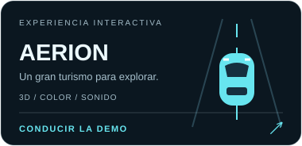

# AERION

### The air, engineered.

Una experiencia de gran turismo eléctrico, diseñada para explorar un vehículo en 3D y verlo en carretera.

[**Abrir la experiencia →**](https://pablo2611.github.io/aerion/)

<a href="https://pablo2611.github.io/aerion/"></a>

## Explora

- **Puertas articuladas:** apertura y cierre sobre las bisagras del modelo. Las llantas se detienen al abrirlas y las puertas se cierran al salir a carretera.
- **Cabina sin volante:** pantalla panorámica, consola integrada y luz ambiental. Usa **Entrar a cabina** en el concesionario o **Cabina IA** en carretera para viajar desde dentro. El piloto y los datos de las pantallas son una simulación local.
- **Calidad automática:** límite de píxeles y de fotogramas, reducción de calidad cuando baja el rendimiento y pausa del 3D y los vídeos cuando no se ven. Si falla WebGL, la página conserva sus contenidos y ofrece reintentar.
- **Carretera en movimiento:** cámara 360° con arrastre, scroll y teclado; ruedas animadas, velocidad gradual y pausa.
- **Nitro de concepto:** impulso de 7 segundos hasta 460 km/h, siete marchas virtuales con bajadas de revoluciones y golpes de escape, toma automática de las llamas 3D y regreso a tu cámara anterior. Crucero regulable hasta 420 km/h; récord de velocidad visible. Es un paquete deportivo ficticio de la simulación.
- **Tu color:** ocho pinturas, acabados, interiores y firmas luminosas en vivo.
- **Llantas intercambiables:** AeroBlade de cinco brazos, Turbine, Monolith perforada y Vector RS de radios dobles. Cambian la geometría real conservando el mismo diámetro, ancho y neumático.
- **Sonido:** dos modos que responden a velocidad y nitro: Carrera usa una grabación de motor y Eléctrico usa sonido digital. El motor conserva ralentí al detener el coche y se activa al entrar a carretera. La música baja al 8% y tiene control independiente de 0 a 30%; recupera su volumen al salir.
- **Asistente en la pantalla del coche:** controles anclados a la pantalla 3D, con preguntas por micrófono, botones o entrada escrita y respuestas habladas en español. Consulta velocidad, batería, autonomía, temperaturas, motor, llantas y recorrido; ajusta velocidad, faros, volumen y piloto. Prueba «¿cómo está el motor?» o «pon la velocidad a 420». La música y el motor bajan mientras escuchas una respuesta o usas el micrófono.
- **Ver motor:** detiene el vehículo y abre una inspección del tren motriz eléctrico, con dos motores traseros, inversor refrigerado, cableado y soportes. Cierra la vista y pulsa Continuar para conducir.
- **Trasera integrada:** difusor continuo, salidas ovaladas empotradas, reflectores y placa AERION; las llamas salen de las nuevas boquillas.
- **Paisaje costero:** terreno continuo con relieve suave, vegetación en instancias, mar animado, cielo y nubes; la vegetación sigue la distancia del recorrido. Humo con turbulencia, faros sobre la carretera y recorrido por nueve capítulos con scroll nativo.

La asistencia interpreta consultas y comandos locales sobre la simulación; no está conectada a un modelo de IA generativa. El reconocimiento de voz depende del navegador y requiere permiso de micrófono; algunos navegadores procesan esa voz mediante su servicio en línea. La entrada escrita y los botones funcionan sin micrófono. Las prestaciones, precios y sensores son ficticios. El concepto es eléctrico y no utiliza gasolina.

## Controles de carretera

1. Pulsa **Ver en carretera**; el motor se activa con ese gesto.
2. Arrastra para girar 360°, usa la rueda del mouse para acercar o las flechas del teclado para cambiar la vista.
3. Abre **Velocidad, sonido y color** para alternar **Carrera / Eléctrico**, ajustar velocidad y volumen, o bajar la música a cero.
4. Pulsa **NITRO** para ver los escapes con fuego y escuchar el impulso. Tras 7 segundos vuelve a tu vista; el botón se recarga durante 2,5 segundos más.
5. **Pausar** detiene la conducción. **Volver a la web** o Escape sale del modo carretera.
6. **Ver motor** ofrece la inspección detenida; **Cabina IA** lleva al asistente integrado en la pantalla.

Si no escuchas el motor, comprueba que la pestaña no esté silenciada y que el volumen del motor sea mayor que cero. La música se carga aparte para no bloquear el motor.

## Desarrollo

```sh
npm ci
npm run dev
npx tsc --noEmit
npm run test:cabin
npm run build
```

React 19 · TypeScript · Three.js · React Three Fiber · GSAP · Web Audio · Web Speech.

El modelo comprimido Draco/KTX2 y sus texturas se sirven desde este repositorio. Los decodificadores se cargan desde sus CDN originales. El render limita la densidad de píxeles, adapta partículas al dispositivo, comparte materiales y se suspende cuando la pestaña está oculta. Los postes de carretera utilizan instancias y el código 3D se entrega en un archivo independiente con caché.

## Créditos

Car Concept © 2024 Darmstadt Graphics Group GmbH, por Eric Chadwick — [CC BY 4.0](https://creativecommons.org/licenses/by/4.0/). [Modelo original](https://github.com/KhronosGroup/glTF-Sample-Assets/tree/main/Models/CarConcept). Se modificaron materiales, luces, cámaras y movimiento; los logotipos de Khronos y 3D Commerce no se muestran. Detalles en [CREDITS](public/models/CREDITS.md).

Imágenes de concepto incluidas en el proyecto original. Referencias y video: Pexels, acreditados en la web. Música ambiental original sintetizada para estos proyectos.

Motor grabado: [racing car engine sound loops](https://opengameart.org/content/racing-car-engine-sound-loops), por domasx2, CC0. Normalizado y adaptado para repetición continua y respuesta a velocidad. [Créditos del audio](public/audio/ENGINE-CREDITS.md).

## Escena 3D editable
La carretera usa geometría real: costa y barreras preparadas en Blender 4.5 LTS,
acantilados y vegetación CC0 de Poly Haven y cielo atmosférico. El mar se anima
con desplazamiento de vértices. No hay una foto panorámica como fondo.

Abre `assets-source/coastal-stage.blend` para editar la composición completa.
`assets-source/build_coast.py` reproduce la exportación del escenario GLB.
El navegador instancia las rocas y árboles por separado para limitar memoria.

En Cabina IA puedes pedir «pon la velocidad a 120», «cambia al carril derecho»,
«activa el nitro», «desactiva el nitro», «para», «continúa» o ajustar los faros.
El asistente local responde por voz y aplica los controles a la simulación.
Los cambios de carril respetan el tráfico y el nitro tiene recarga compartida.
