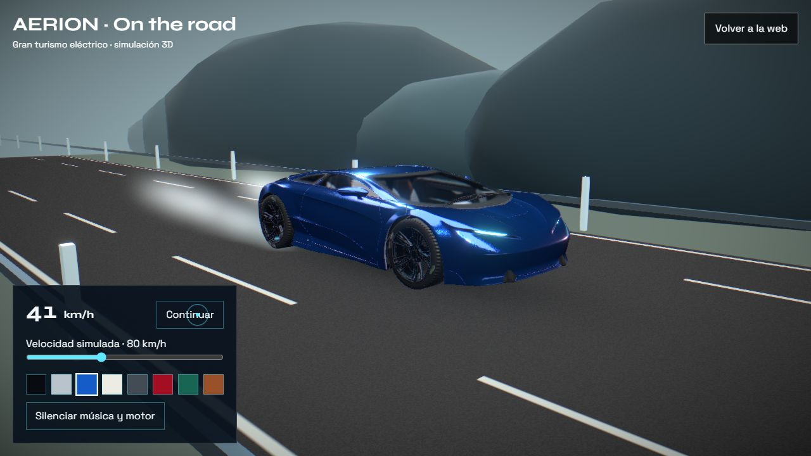

# AERION

### The air, engineered.

Una experiencia de gran turismo eléctrico, diseñada para explorar un vehículo en 3D y verlo en carretera.

[**Abrir la experiencia →**](https://pablo2611.github.io/aerion/)



## Explora

- **Carretera en movimiento:** ruedas animadas, velocidad gradual de 20 a 180 km/h, pausa y paisaje de montaña.
- **Tu color:** ocho pinturas, acabados, llantas, interiores y firmas luminosas en vivo.
- **Sonido:** música ambiental original y motor eléctrico sintetizado que responde a la velocidad. El sonido se activa con un botón.
- **Voz en español:** respuestas habladas y comandos como «noche», «autonomía», «sensores» o «relajar».
- **Atmósfera:** humo de flujo suave, iluminación de estudio y recorrido por nueve capítulos.

La asistencia es una demo local con comandos predefinidos; no conecta con Claude ni con un servicio de IA. El reconocimiento de voz depende del navegador y requiere permiso de micrófono. Los botones funcionan sin micrófono. Las prestaciones, precios y sensores son ficticios.

## Desarrollo

```sh
npm ci
npm run dev
npx tsc --noEmit
npm run build
```

React 19 · TypeScript · Three.js · React Three Fiber · GSAP · Web Audio · Web Speech.

El modelo comprimido Draco/KTX2 y sus texturas se sirven desde este repositorio. Los decodificadores se cargan desde sus CDN originales. El render limita la densidad de píxeles, adapta partículas al dispositivo, comparte materiales y se suspende cuando la pestaña está oculta. Los postes de carretera utilizan instancias y el código 3D se entrega en un archivo independiente con caché.

## Créditos

Car Concept © 2024 Darmstadt Graphics Group GmbH, por Eric Chadwick — [CC BY 4.0](https://creativecommons.org/licenses/by/4.0/). [Modelo original](https://github.com/KhronosGroup/glTF-Sample-Assets/tree/main/Models/CarConcept). Se modificaron materiales, luces, cámaras y movimiento; los logotipos de Khronos y 3D Commerce no se muestran. Detalles en [CREDITS](public/models/CREDITS.md).

Imágenes de concepto incluidas en el proyecto original. Referencias y video: Pexels, acreditados en la web. Música ambiental original sintetizada para estos proyectos.
